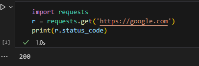

# Звіт до роботи 1
## Тема: Віртуальні середовища
### Мета роботи: налаштувати середовище, та попрацювати з віртуальним середовищем та оформити звіт

---
### Виконання роботи
* Результати виконання завдання *1...N*;
    1. Розробив репозиторій [посилання на нього] (https://github.com/VasylynaYurij/KN_41_VaYu-2)
    1. Навчився працювати з репозиторієм та налаштував інтеграцію з Visual Studio Code;
    1. Написав [першу програму Python та запустив її](./my.py). Програма вивела текст представлений на скріншоті:
    
    1. Написав [другу програму Python та запустив її](./my_app.ipynb). Програма вивела текст представлений на скріншоті:
    
    1. Написав [третю програму Python та запустив її](./my_app.ipynb). Програма вивела текст представлений на скріншоті:
    

   
---
### Висновок:

- У цій роботі було розроблено програму яка виводить в який час я почав програмувати та найкраще місто, також я оформив репозиторій, котрий буде далі доповнюватись.
- Так, мету було досягнуто, я створив репозиторій та оформив його, було створено кілька програм, та заповнити звіт.
- Я дізнався як працювати з Git, також підвищив навик написання програм, та в загальному стало зрозуміліше працювати з Visual studio code.
- Так написав усі відповіді на усі питання.
- Поки що завдання не є такі тяжкі тому виконав усе добре.
- Ні, не виникло досить все зрозуміло якщо все знати.
- Ну повинно бути щось нове у житті, такого в мене ще не було, тому це перший експіріенс, так не звично але досить не погано як для програмістів.
- Поки що все влаштовує, нехай лишається все як є.

---