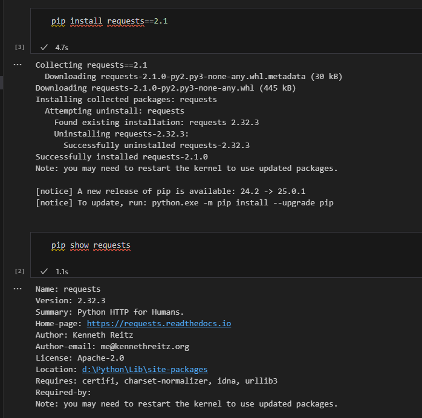

# Звіт до роботи 1
## Тема: Віртуальні середовища
### Мета роботи: налаштувати середовище, та попрацювати з віртуальним середовищем та оформити звіт

---
### Виконання роботи
* Результати виконання завдання *1...N*;
    1. Передивіться які дії можна зробити за допомогою pip. Перевірте які бібліотеки вже інстальовані на Вашому компютері та вкажіть їх у звіті (скріншот або стрічки що вивелись) Програма вивела текст представлений на скріншоті: 
    1. Після написання команд які є на скріншоті програма видала число 200. Скріншот результату: 
    1. Після виконання команд "pip show requests, pip install requests==2.1, та pip uninstall requests, на скріншоті видно результат виконання цих програм. Скріншоти:  
    1. Після запуску програми [anime.py](anime.py), вийшов ось такий результат. Результат 
    1. Команди які можна використати за допомогою pipenv є: pipenv install, pipenv install <package>, pipenv install --dev <package>, pipenv uninstall <package>, pipenv uninstall --dev <package>, pipenv lock, pipenv shell, pipenv check, pipenv graph, pipenv --venv, pipenv --python <version>, pipenv run <command>
    1. У Pipfile міститься конфігурація для проєкту, зокрема налаштування джерела пакетів (pypi), вказівка на те, що для роботи потрібна версія Python 3.12, а також залежність від пакету requests без зазначення конкретної версії. А у Pipfile.lock зберігається більш детальна інформація про залежності та їхні версії. Включає дані про хеші пакетів, що гарантують цілісність, а також вказує, що використовувана версія Python — 3.12. Також вказується список бібліотек з їхніми версіями та хешами для перевірки.
    1. Змініть інтерпретатор Python із Вашого середовища та виконайте скрипт через кнопку Run. Представте результат у звіті. Ось що в мене получилось:   
    1. Середовища також можна параметризувати за допомогою змінних середовища (Environment Variables). Для цього у папці повинен буди файл .env із заданими змінними у форматі KEY=VALUE. Pipenv автоматично розпізнає ці файли та робить їх доступними всередині середовища. Створіть файл .env та виконайте наступний код "import os, os.environ['HELLO']". Після виконання коду програма виводить слово "world", ось скріншот виконання та результату: 
    1. Що буде якщо виконати скрипт без активації віртуального середовища? Відповідь: Якщо виконати скрипт без активації віртуального середовища, змінні середовища з файлу .env не будуть доступні, що призведе до помилки KeyError, якщо спробувати їх використати. Крім того, без активації віртуального середовища Python не знайде необхідні бібліотеки, встановлені для цього середовища, і виникне помилка ModuleNotFoundError. Активація віртуального середовища необхідна для коректної роботи з залежностями та змінними середовища
    1. Я попрацював з Poetry, та ось звіт виконаних команд:  
--- 
### Висновок:

- У цій роботі я працював з віртуальним середовищем, також працюював з інструментом Poetry, та навчився чогось нового.
- Так, мету було досягнуто, я створив другий новий репозиторій вже для іншого курсу та оформив його, було створено кілька програм, та заповнив звіт.
- Я дізнався більше про різні команди і можливості створення програм, також підвищив навик написання програм.
- Так написав усі відповіді на усі питання.
- Трішки було потрібно корегувати завдання деякі, тому що були помилки, але завдання були усі виконані.
- Ні, не виникло досить все зрозуміло.
- Так звісно подобається. це цікавіше ніж писати щось на листку.
- Поки що все влаштовує, нехай лишається все як є.

---