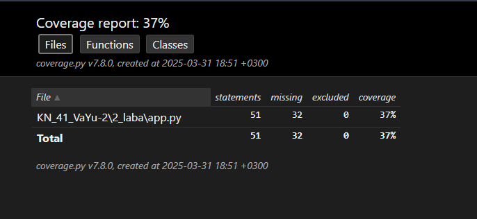

# Звіт до роботи 2

## Тема: Тестування

### Мета роботи
Метою цієї роботи було перевірити правильність роботи програм, їх функцій і поведінки за різних умов. Це досягається шляхом створення штучних ситуацій або сценаріїв для перевірки, а також оформлення звіту про виконану роботу.

---

### Виконання роботи
1. Спочатку я встановив інструмент Poetry для управління залежностями та віртуальними середовищами в Python. В результаті я налаштував Poetry та зміг додати необхідні бібліотеки для тестування, такі як `pytest` і `coverage`.

2. Для забезпечення покриття тестами було налаштовано плагін `pytest-cov`. Після цього я зібрав покриття коду і зміг перевірити, скільки відсотків коду покривають тести.

3. Після налаштування тестів у файлі `test.py` я використовував команду `poetry run pytest` для запуску тестів. Були виявлені помилки в тестах, які потім я виправив. Зокрема, тест на функцію `test_app_triangle`, яка мала перевіряти правильність визначення кількості кутів для трикутника, не виконалась через відсутність визначення класу `Figure` в тесті. Після додавання необхідних імпортів і виправлення коду, тест пройшов успішно.

4. В результаті виконання тестів програма вивела наступне:
    ```
    ==========================================================================================
    test session starts
    platform win32 -- Python 3.12.6, pytest-8.3.5, pluggy-1.5.0
    rootdir: D:\Gitrepositoty-Numerical methods
    configfile: pyproject.toml
    plugins: anyio-4.8.0, cov-6.0.0
    collected 1 item

    KN_41_VaYu-2\2_laba\test.py::test_get_angles 
    [PASSED] 
    ==========================================================================================
    ```

5. Для візуалізації покриття я згенерував звіт у форматі HTML за допомогою команди `poetry run python -m coverage html`. Це дозволило переглянути звіт у браузері для зручнішого аналізу покриття. Ви можете переглянути цей звіт у браузері, відкривши файл `index.html`, який знаходиться за шляхом: D:\Gitrepositoty-Numerical methods\htmlcov\index.html. 
Звіт показує деталі покриття коду, включаючи інформацію про виконані рядки, функції та методи.

Нижче наведено скріншот з результатами тестування, який збережено за шляхом: D:\Gitrepositoty-Numerical methods\KN_41_VaYu-2\2_laba\Знімок екрана 2025-03-31 185328.png 

6. Було налаштовано тестування коду за допомогою різних бібліотек для забезпечення покриття коду та перевірки правильності його виконання.

---

### Висновок
- У результаті роботи я ознайомився з інструментами для автоматизованого тестування програм у Python: Poetry для управління залежностями, pytest для тестування та coverage для збору статистики покриття коду.
- Метою було досягнуто, я створив новий репозиторій, налаштував тестування для нового курсу, розробив програми, а також підготував звіт про виконану роботу.
- Я дізнався більше про можливості автоматизованого тестування та генерації звітів про покриття коду, що значно підвищило мої навички в програмуванні.
- Окрім написання тестів, були деякі помилки в налаштуваннях, які я виправив по ходу виконання завдання.
- Завдання було виконано успішно, і всі тести пройшли після їх виправлення.
- Загалом, я задоволений результатами, і мені подобається працювати з інструментами для тестування, оскільки це дозволяє краще перевіряти правильність коду та підвищувати ефективність розробки.
