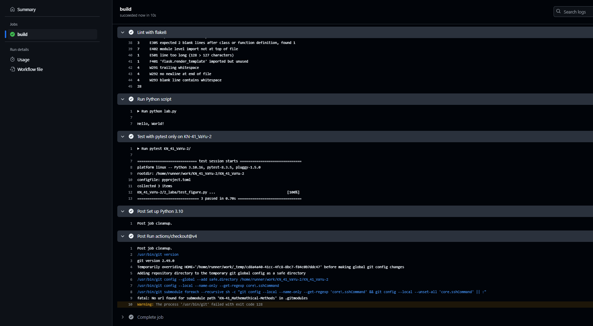
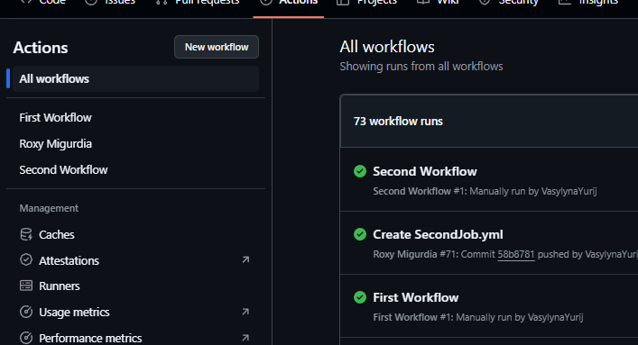
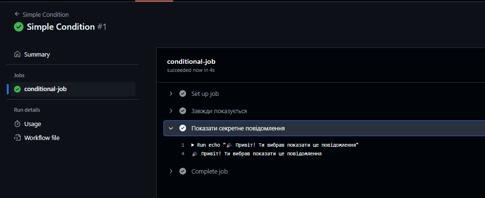
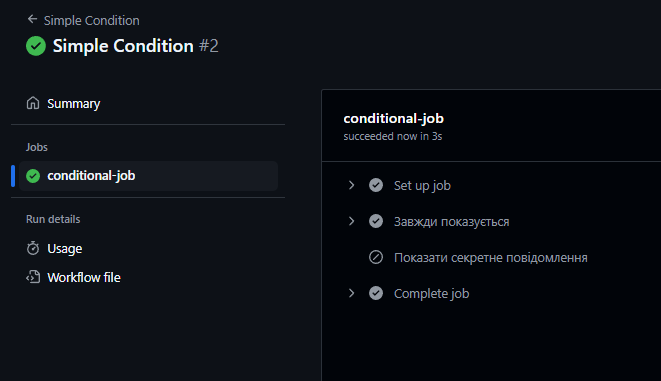

# Звіт до роботи 3

## Тема: Автоматизація процесу тестування

### Мета роботи
Метою цієї роботи було створити автоматизацію процесу тестуання, створення баджі та статусу.

---

### Виконання роботи

1. Створили перший WorkFlow 

2. Створив декількох Workflow або завдань 

3. Перевірка умов для запуску завдань або кроків  

4. Баджі та статус 

---

### Висновок
- У результаті роботи я ознайомився з WorkFlow, pytest для тестування та coverage для збору статистики покриття коду.
- Метою було досягнуто, підготував звіт про виконану роботу.
- Я дізнався більше про можливості автоматизованого тестування та генерації звітів про покриття коду, що значно підвищило мої навички в програмуванні.
- Окрім написання тестів, були деякі помилки в налаштуваннях, які я виправив по ходу виконання завдання.
- Завдання було виконано успішно, і всі тести пройшли після їх виправлення.
- Загалом, я задоволений результатами, і мені подобається працювати з інструментами для тестування, оскільки це дозволяє краще перевіряти правильність коду та підвищувати ефективність розробки, але дуже складне в виконанні дуже довго сидів над тим всім, також додаткове завдання не було зроблено тому що і так просидів дуже довго з тим, і нічого не получалось з ним, тому...що вийшло то вийшло.
